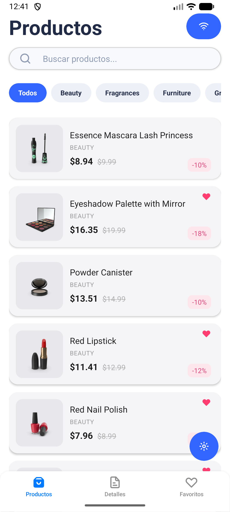
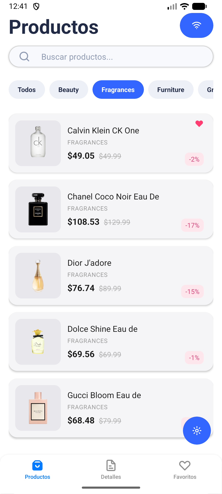
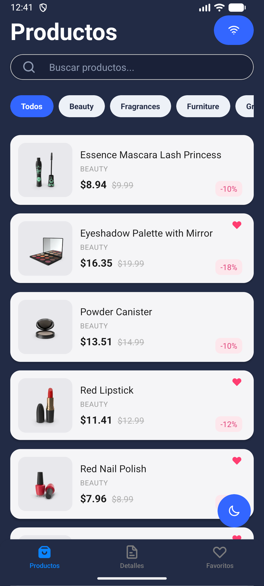
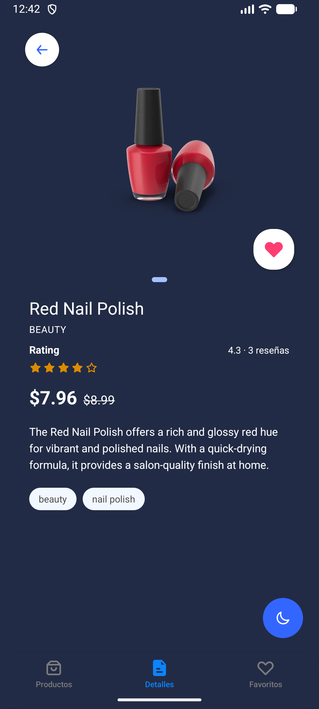
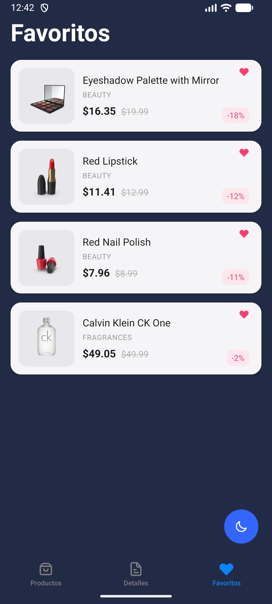
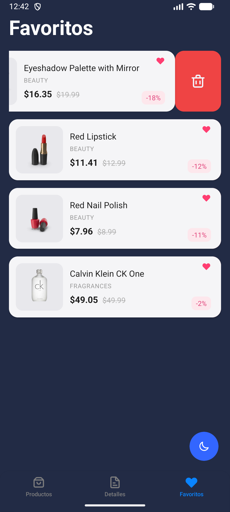
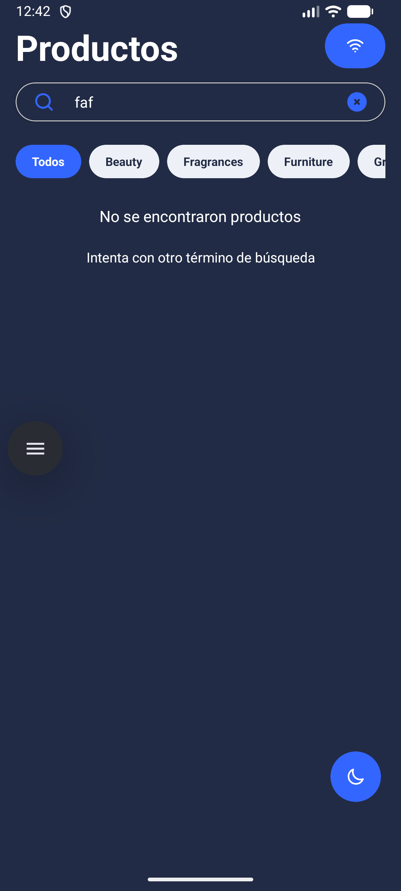
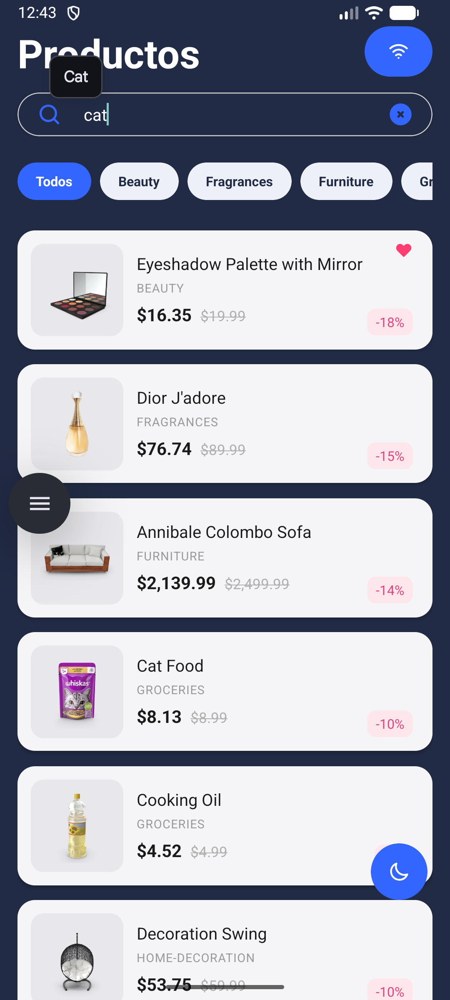

# miniStore

MiniStore es una app que lista productos obtenidos de la api de DummyJSON. La app permite filtrar los productos dependiendo de las categorias, que también vienen de la misma API, y así mostrar un listado por categoria. También permite buscar productos con la barra de busqueda en la pantalla de Productos y permite marcar productos cómo favoritos.

### Requisitos previos

- Node: >= 20
- Package manager (pnpm): 11.24.0
- React Native CLI: 0.81.6
- Ruby / CocoaPods
- Android Studio: For Android development
- Xcode: For iOS development (macOS only)

### Instalación

1. **Clona el repositorio**
```bash
git clone https://github.com/javbk201/miniStore.git
cd miniStore
```

2. **Install dependencies**
```bash
pnpm install
```

3. **iOS: Install native dependencies**
```bash
pnpm pod
```

### Correr en Android

```bash
pnpm android
```

### Correr en iOS

```bash
pnpm ios
```

### Utilities

#### Available Environments

- **local**: Local development (solo local por ser un proyecto de prueba)

#### Commands

```bash
# Start Metro bundler
pnpm start

# Linting y formatting
pnpm lint # corre el linter
pnpm lint:format # Realiza check --check
pnpm format # Aplica formato --fix

# Clear cache
pnpm clean:cache
pnpm clean:modules

# Complete reset
pnpm reset

# Pods (iOS)
pnpm pod
pnpm pod-update
pnpm pod-repo-update
```

## Tests

```bash
pnpm test
```

## Decisiones técnicas

**Estado:** Redux Toolkit con RTK Query

Principalmente porque es con la librería con la que más estoy familiarizado. Redux Toolkit, además tiene la ventaja de integrar el manejo de estados con la persistencia de las peticiones. Puede lograr lo que haría Zustand y React Query con una sola librería.

**Networking:** Axios

Estandar actual. Axios ofrece ventajas que fetch no da, por ejemplo el parseo automatico de JSON, además de tener la posibilidad de incluir interceptors para el manejo de errores.

**Persistecia Local:** MMKV

MMKV es la librería que actuamente tiene el mejor rendimiento en la lectura de valores del local storage. Recomendada en la prueba se decidió implementar debido a las ventajas que ofrece. Preferible para proyectos nuevos.

**Arquitectura de carpetas:**

Se decidió hacer una adaptación de mi modelo personal con el propuesto en la prueba

```
src/
├── api/              # Contiene la configuración básica de Axios y de las peticiones http
├── components/       # Componentes básicos de la app.
├── context/          # Contextos generales de la app. 
├── domain/           # Tipos/interfaces del negocio
├── hooks/            # Custom React hooks generales de la app
├── navigation/       # Navigation configuration
├── screens/          # Pantallas principales.
├── storage/          # configuración de MMKV
├── store/            # Redux store and slices
└── utils/            # Utility functions
```

Hay componentes en la carpeta de components que no son necesariamente reitilizables en otras pantallas, como por ejemplo ratingStar. En el estado actual del proyecto no es un componente que se use en otras pantallas, por lo que básicamente puede quedar dentro de la carpeta de src/screens/ProductDetails/components, esto según mi modelo personal de organización.

**Componentes:**

Hay algunas decisiones técnicas sobre los componentes que me gustaría resaltar. En el caso de ThemedBox, las tres pantallas principales tenían la misma estructura, componente, styles y params. Con el fin de no repetir esto en las 3 pantallas y no tener los estilos duplicados se creó este componente que permite envolver las pantallas y además les aplica el background dependiendo del theme.

**Navegación:**

El tabBar contiene las tres pantallas: Productos, Detalle y Favoritos. Al entrar en el detalle de cada producto, sea desde la pantalla de Productos o de Favoritos siempre navega a la tab de Detalles.

**Animaciones:**

La animación del carusel de imagenes y el botón de favoritos del detalle está completamente echo con Reanimated. La animación del skeleton, en cambio está echa con la API nativa. La prueba especificaba solamente la animación de ese componente. La animación del skeleton fue reutilizada de un repositorio de otro proyecto con el fin de ahorrar tiempo y que que el skeleton no se viera soso.

**Borrado de favoritos:**

Se eligió el Swipe-to-delete debido a que me parece que en el caso de los dispositivos moviles un gesto de deslizar a la izquiera es más natura que un botón. Hay ciertos comportamientos o acciones que se asocian más con los dispositivos moviles.

**UI Theme:**

Con el fin de no tener que crear componentes básicos desde cero y hacerlos personalizables, use una librería de componentes llamada UI Kittens. Esta librería me permite incluir Iconos, Inputs personalizables, Text y View que se adaptan al tema, entre otras ventajas adicionales. Lo que más me gusta de este UI Kit es la facilidad de uso e implementación de los iconos. Hay una gran varidad de iconos disponibles y también son bastante estilizados. Adicionalmente esta librería me permitió trabajar la selección del thema (light, dark) de forma más sencilla y generalizada. Haciendo uso de los colores del thema que se adaptan automaticamente pude ajustar un estilo uniforme en toda la app. A nivel técnico, la app detecta el tema del télefono, pero el usuario cuenta con un FAB para el toggle del tema. El tema se cambia con la ayuda del context, pero también se guarda como un valor local para que el valor persista, aún si se cierra la app.

**Módulo nativo:**

El modulo nativo creado corresponde a la obtención del tipo de red a la que el usuario está conectado. En la pantalla de Product se agregó un botón que muestra un icono con el simbolo de Wifi en caso de estar conectado a la red WIFI, pero si se conecta a los datos el icono mostrará el icono de WIFI off. Cabe resaltar que el cambio no es automatico. Solo expuse el dato y no se actualiza a menos de que se haga focus en la pantalla de Productos.

## Screenshots / GIF









